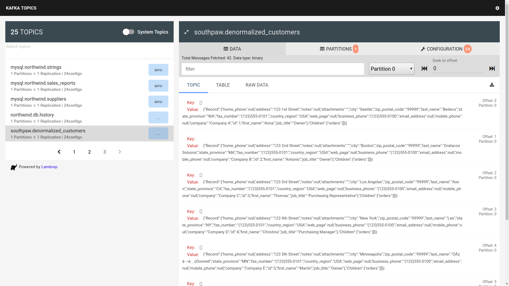

# Southpaw Example

This is a working example of an end-to-end pipeline using Southpaw and Debezium.

The Kafka topics are generated and populated using
[Debezium](https://github.com/debezium/debezium), which does data change capture
on databases including MySQL.

The database being used is the classic Northwind database adapted from
https://github.com/dalers/mywind.

## Run

```bash
export DEBEZIUM_VERSION=0.8
docker-compose up --build -d
curl -i -X POST -H "Accept:application/json" -H  "Content-Type:application/json" http://localhost:8083/connectors -d @register-debezium.json)
# wait ~10s for services to start before re-running southpaw
docker-compose up -d southpaw
docker-compose logs -f -t
```

You can view the records by looking at the kafka-topics UI: http://localhost:8000.
The output should look something like the following image:

